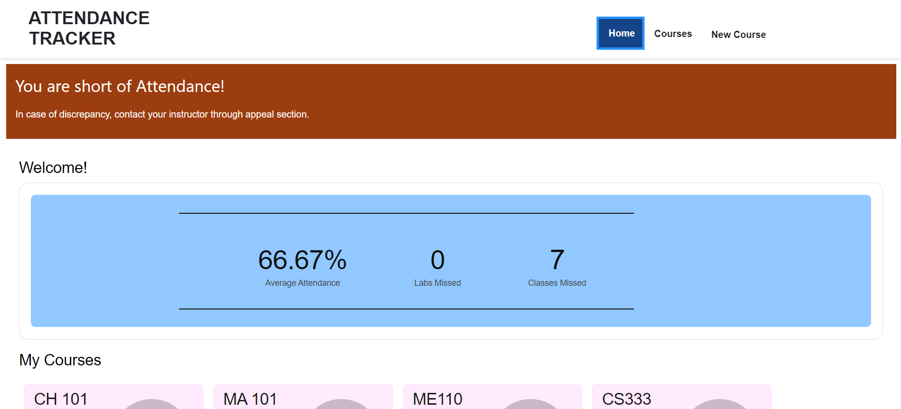
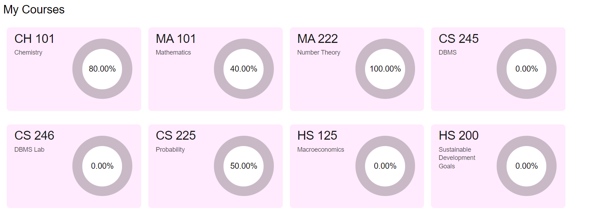
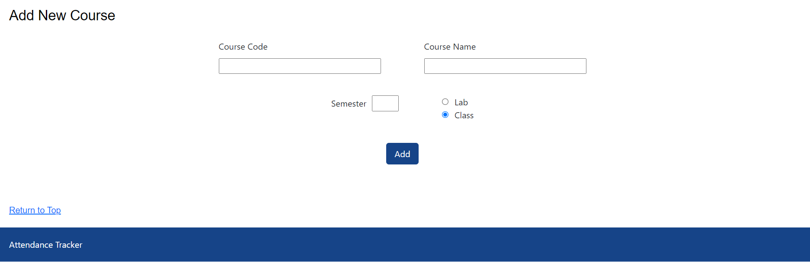
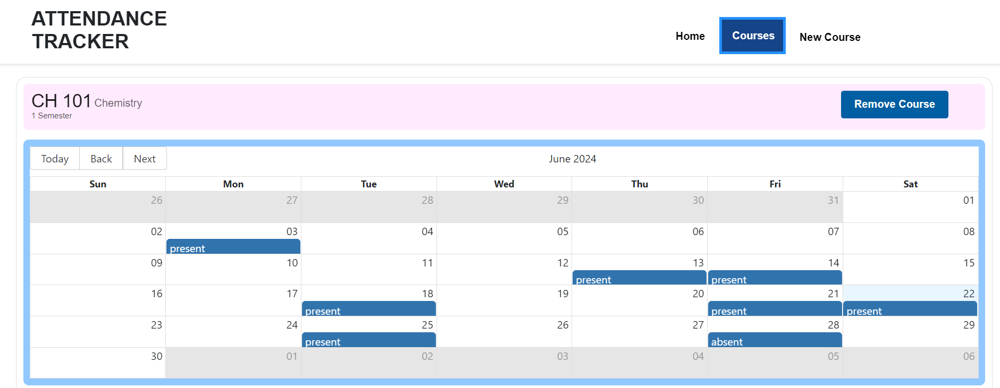
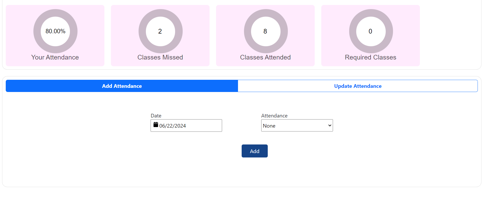

# Attendance Management App

A web application that helps users in tracking and managing their attendance built using MERN stack.

## Features
- Add or remove courses
- Add or update attendance for a particular course
- Track the attendance percentage, classes and labs missed
- Get alerts if attendance falls below a threshold

## Installation

Follow these steps to set up the project on your local machine.

### Prerequisites

Ensure you have the following installed:
- [Node.js](https://nodejs.org/) 
- [npm](https://www.npmjs.com/)

### Setup

1. **Clone the repository:**

   ```bash
   git clone https://github.com/arushjain609/Attendance-Tracker.git
   cd Attendance-Tracker
   ```

2. **Install dependencies:**

   ```bash
   npm install
   ```

### Running the Applications

You need to run both the frontend and backend applications. Follow the steps below for each.

#### Frontend

1. **Navigate to the frontend directory:**

   ```bash
   cd frontend
   ```

2. **Start the frontend application:**

   ```bash
   npm run dev
   ```

   This will start the frontend application in development mode. 
#### Backend

1. **Navigate to the backend directory:**

   ```bash
   cd backend
   ```

2. **Start the backend application:**

   ```bash
   npm run dev
   ```

   This will start the backend server.


## Screenshots 





